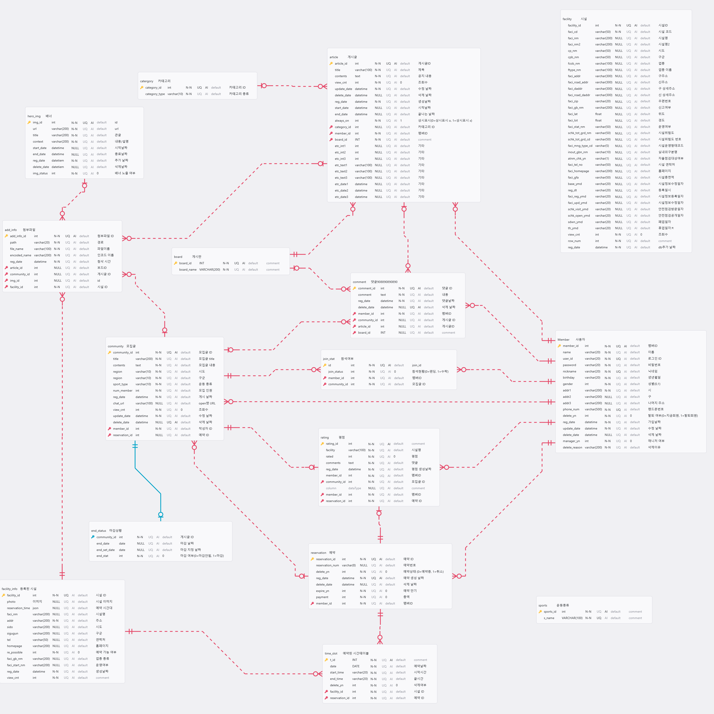

# Best Choice (BC_Project)
---
## 📌 프로젝트 소개 (KOREA IT ACADEMY 국비지원 과정 팀 프로젝트)

**할래말래**는 체육진흥공단이 주관한 공공데이터 활용 공모전에 참가하기 위해 개발한 Django 기반 공공시설 예약 및 커뮤니티 웹 서비스입니다.

사용자는 공공데이터를 기반으로 체육 시설을 조회 및 예약할 수 있으며,
모집 게시판을 통해 운동 정보 공유 및 함께 운동할 사용자를 모집할 수 있습니다.

단순 예약 시스템을 넘어, 공공시설 이용 활성화와 사용자 간 커뮤니티 형성을 목표로 설계된 서비스입니다.

---

## 📌 프로젝트 배경

공공 체육시설은 예약 시스템이 기관별로 분산되어 있어 접근성이 낮은 문제가 있습니다.
또한 최근 러닝크루, 단체 운동 등 개인 운동보다 함께하는 운동 문화가 증가하고 있으나,
공공시설 예약 시스템과 모집 커뮤니티 기능은 대부분 분리되어 운영되고 있습니다.

이에 공공시설 예약 기능과 모집 커뮤니티 기능을 하나의 플랫폼에 통합한다면,
공공시설 이용률을 높이고 사용자 간 상호작용을 활성화할 수 있다고 판단했습니다.

본 프로젝트는 공공데이터를 활용하여

- 공공 체육시설 정보를 통합 제공하고
- 온라인 예약 기능을 구현하며
- 사용자 간 소통 및 운동 모집 기능을 결합한 플랫폼을 구축하는 것을 목표로 기획되었습니다.

---

## 📌 프로젝트 개요

- 프로젝트명: 할래말래
- 개발 기간: 2025.11.17 ~ 2025.12.24
- 팀명: 최강선택
- 개발 형태: 4인 팀 프로젝트 (KOREA IT ACADEMY 과정)

### 👥 팀 구성 및 역할

- 강대광: 예약 시스템 설계 및 구현, 회원 관리 및 인증 기능 개발
- 최무선: 카카오 로그인 연동, 통계 대시보드 및 AI 분석 기능 구현
- 최재영: 모집 게시판, 마이페이지, 공지사항 기능 개발
- 오경택: 서버 관리 및 공공시설 관리 기능 구현

### 🎯 프로젝트 목표

- 공공데이터 기반 공공시설 예약 서비스 구현
- 예약 시간 중복 방지 로직 설계
- 사용자 권한 분리 및 관리자 기능 구현
- 커뮤니티 기능을 통한 공공시설 이용 활성화

---

## 🛠 Tech Stack

### Backend
- Python 3.12.5
- Django 5.2.8

### Database
- MySQL (AWS RDS)

### Frontend
- HTML5
- CSS3
- JavaScript
- Django Template

### Deployment
- AWS EC2 (Ubuntu)
- Gunicorn
- Nginx
- AWS RDS (MySQL)

### Collaboration
- Git / GitHub
---
## 🔑 주요 기능

### 1️⃣ 회원 기능
- 일반 회원가입 및 카카오 소셜 로그인 지원
- 사용자 권한 분리 (일반 사용자 / 관리자)
- 주소 기반 사용자 정보 관리

### 2️⃣ 공공시설 기능
- 공공데이터 기반 시설 목록 조회
- 회원 주소 기반 지역 시설 필터링
- 시설 상세 정보 제공

### 3️⃣ 예약 기능
- 날짜 및 시간대 선택 예약
- 시간 구간 겹침 방지를 통한 예약 중복 차단
- 사용자별 예약 내역 조회

### 4️⃣ 모집 기능
- 모집 게시글 CRUD
- 모집 참여 신청 및 상태 관리 (승인 / 대기 / 거절)
- 댓글 기능
- 모집 상태 관리

### 5️⃣ 관리자 기능
- 시설 및 사용자 관리
- 통계 대시보드 제공 (예약 추이, 신규 회원 수 시각화)
- 관리자 전용 AI 챗봇 기능 제공

## 🤖 관리자용 AI 챗봇 (OpenAI API 연동)

웹사이트 운영을 보다 효율적으로 관리하기 위해
OpenAI API를 연동한 관리자 전용 AI 챗봇 기능을 구현했습니다.

- Django 서버에서 OpenAI API 호출
- 관리자 페이지 내 AJAX 기반 비동기 응답 처리
- 통계 데이터 기반 운영 질의응답 지원

관리자가 자연어로 질문을 입력하면,
서버(View)에서 OpenAI API에 요청을 전송하고
응답을 JSON 형태로 반환하여 관리자 화면에 출력하는 구조로 구현했습니다.

API Key는 환경변수로 관리하여 보안을 유지했습니다.

---
## 🗂 Database Design (ERD)

- Member를 중심으로 Reservation, Community, Comment, Rating 등 주요 도메인이 1:N 관계로 연결됩니다.
- Reservation은 Facility 및 Time_slot과 연결되어 예약 흐름을 관리합니다.
- Community는 Article, Comment, Join_stat과 연결되어 모집 및 커뮤니티 활동을 구성합니다.
- Add_file은 게시글 및 시설과 연결되어 파일 업로드 기능을 지원합니다.
- 각 도메인은 상태(status) 및 날짜 필드를 활용하여 흐름 제어가 가능하도록 설계했습니다.
---

## 🧩 주요 App 구조

| App | 역할 |
|------|------|
| facility | 공공데이터 기반 시설 정보 관리 및 조회 기능 |
| reservation | 예약 생성, 시간 중복 검증, 예약 상태 관리 |
| recruitment | 운동 모집 게시글 및 참여 관리 |
| member | 사용자 인증 및 권한 관리 |
| manager | 관리자 전용 통계 및 운영 기능 |
| board | 일반 게시판 및 공지사항 기능 |
| ai_analytics | 예약/회원 데이터 기반 통계 및 분석 기능 |

---
## ⚠️ Trouble Shooting
### 모집 참여 상태(PENDING) 및 자동 마감 타이밍 설계

**문제 상황**

모집 기능 구현 중 다음 두 가지를 어떻게 설계할지 고민했습니다.

1. 참여 신청 즉시 인원에 포함할 것인가?
2. 모집 정원 초과 및 마감 시점을 어떻게 제어할 것인가?

초기에는 참여 신청과 동시에 인원에 포함시키는 방식을 고려했으나,  
이 경우 작성자의 승인 없이 모집이 마감되거나 정원이 초과될 가능성이 있었습니다.

---

**설계 고민**

- 대기(PENDING) 상태를 정원 계산에 포함할 것인가?
- 승인/거절 흐름을 어떻게 분리할 것인가?
- 정원이 모두 찼을 때 자동으로 모집을 마감할 것인가?
- 마감 날짜 기반 종료와 인원 기반 종료를 함께 처리할 수 있는가?

---

**해결 방법**

1️⃣ 참여 상태를 `PENDING(0)`, `APPROVED(1)`, `REJECTED(2)`로 분리  
2️⃣ 정원 계산 시 `APPROVED` 상태만 카운트  
3️⃣ 승인 인원이 모집 정원(capacity)에 도달하면 자동으로 `end_stat = 1` 처리  
4️⃣ `end_set_date`를 별도 관리하여 날짜 기반 마감과 인원 기반 마감을 모두 지원

이를 통해 작성자 승인 기반 흐름을 유지하면서도  
정원 초과 문제를 방지할 수 있도록 설계했습니다.

---

**결과**

- 승인 기반 참여 확정 구조 완성
- 모집 인원 초과 방지
- 상태 전이 중심의 안정적인 모집 흐름 구현
---

## 🎥 발표 영상

- 프로젝트 발표 영상 : [발표 영상 링크](https://www.youtube.com/watch?v=LaZt3GMA-yY&feature=youtu.be)
- 프로젝트 발표 화면 영상 : [발표 화면 영상 링크](https://www.youtube.com/watch?v=XAM7G9b4QOg&feature=youtu.be)
- 발표 자료(PPT): [PDF 링크](https://github.com/MUNJI-KANG/Best_Choice_Project/blob/main/docs/%EC%B5%9C%EA%B0%95%EC%84%A0%ED%83%9D%20%EB%B0%9C%ED%91%9C%20PPT.pptx)
---
