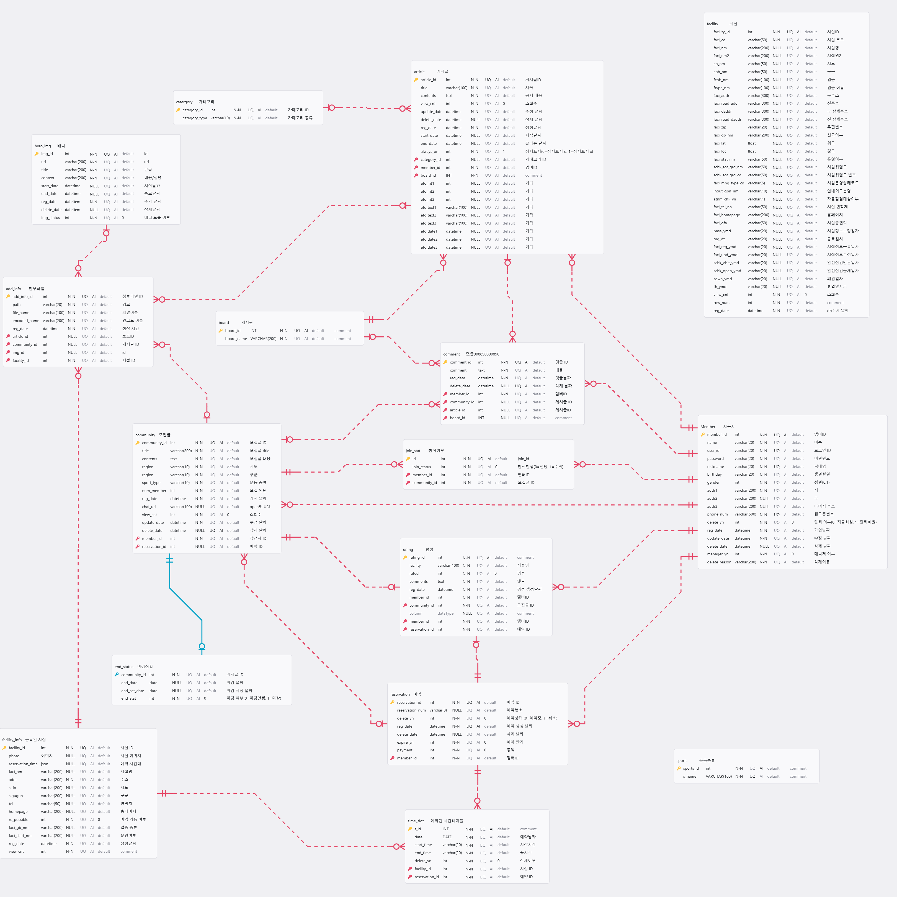

<p align="center">
  
</p>

# 🏆 Best Choice (BC_Project) - 할래말래
> **공공 체육시설 예약, 모집, 관리자 운영 기능을 포함한 Django 서비스**

---

## 📌 프로젝트 요약

공공 체육시설 데이터를 기반으로 **시설 조회 -> 예약 -> 모집 커뮤니티 -> 관리자 운영** 흐름을 구성한 Django 웹 서비스입니다.

이 프로젝트에서 저는 **예약 도메인 설계, 회원 인증/세션 처리, 예약과 모집 기능 간 연결 로직**을 담당했습니다.

---

## 🙋 담당 범위

### 1. 예약 도메인 설계 및 구현

- `Reservation` + `TimeSlot` 구조로 시간대 단위 예약 모델 설계
- 시설별 `reservation_time` JSON 정책 기반 예약 가능 여부 검증
- 서버 기준 결제 금액 계산 로직 구현
- 마이페이지 / 관리자 화면에서 부분 취소 지원
- 예약 만료 상태(`expire_yn`) 관리

### 2. 회원 인증 및 세션 처리

- 일반 로그인 / 로그아웃 / 회원가입 구현
- 세션 기반 인증 흐름 구현
- 로그인 유지 여부에 따른 세션 만료 제어
- 아이디 / 비밀번호 찾기 기능 구현
- 회원정보 수정 / 비밀번호 변경 / 회원 탈퇴 처리

### 3. 예약-모집 연결 로직

- 실제 예약 이력이 있는 일정만 모집글과 연결되도록 제한
- 이미 사용 중인 예약은 모집글 작성/수정 후보에서 제외
- 예약 데이터와 모집 데이터 간 1:N 혼선을 막는 검증 로직 구현

---

## 🛠 Tech Stack

### Backend
-  **3.12.5**
-  **5.2.8**

### Database
-  **기본 개발 DB**
-  **확장 고려**

### Frontend
- 
- 
- 
- 

### External APIs
- 
- 
- 
- 
- 

### Collaboration
-  / 

---

## 🔑 주요 기능

### 1️⃣ 회원 기능
- 일반 회원가입 및 카카오 소셜 로그인 지원
- 사용자 권한 분리 (일반 사용자 / 관리자)
- 주소 기반 사용자 정보 관리

### 2️⃣ 공공시설 기능
- 공공데이터 기반 시설 목록 조회
- 회원 주소 기반 지역 시설 필터링
- 시설 상세 정보 제공

### 3️⃣ 예약 기능
- 날짜 및 시간대 선택 예약
- 시간 구간 겹침 방지를 통한 예약 중복 차단
- 사용자별 예약 내역 조회

### 4️⃣ 모집 기능
- 모집 게시글 CRUD
- 모집 참여 신청 및 상태 관리 (승인 / 대기 / 거절)
- 댓글 기능
- 모집 상태 관리

### 5️⃣ 관리자 기능
- 시설 및 사용자 관리
- 통계 대시보드 제공 (예약 추이, 신규 회원 수 시각화)
- 관리자 전용 AI 챗봇 기능 제공

## 🤖 관리자용 AI 챗봇 (OpenAI API 연동)

웹사이트 운영을 보다 효율적으로 관리하기 위해
OpenAI API를 연동한 관리자 전용 AI 챗봇 기능을 구현했습니다.

- Django 서버에서 OpenAI API 호출
- 관리자 페이지 내 AJAX 기반 비동기 응답 처리
- 통계 데이터 기반 운영 질의응답 지원

관리자가 자연어로 질문을 입력하면,
서버(View)에서 OpenAI API에 요청을 전송하고
응답을 JSON 형태로 반환하여 관리자 화면에 출력하는 구조로 구현했습니다.

API Key는 환경변수로 관리하여 보안을 유지했습니다.

---
## 🗂 Database Design (ERD)



- Member를 중심으로 Reservation, Community, Comment, Rating 등 주요 도메인이 1:N 관계로 연결됩니다.
- Reservation은 Facility 및 Time_slot과 연결되어 예약 흐름을 관리합니다.
- Community는 Article, Comment, Join_stat과 연결되어 모집 및 커뮤니티 활동을 구성합니다.
- Add_file은 게시글 및 시설과 연결되어 파일 업로드 기능을 지원합니다.
- 각 도메인은 상태(status) 및 날짜 필드를 활용하여 흐름 제어가 가능하도록 설계했습니다.

---

## 🧩 주요 App 구조

| App | 역할 |
|------|------|
| facility | 공공데이터 기반 시설 정보 관리 및 조회 기능 |
| reservation | 예약 생성, 시간 중복 검증, 예약 상태 관리 |
| recruitment | 운동 모집 게시글 및 참여 관리 |
| member | 사용자 인증 및 권한 관리 |
| manager | 관리자 전용 통계 및 운영 기능 |
| board | 일반 게시판 및 공지사항 기능 |
| ai_analytics | 예약/회원 데이터 기반 통계 및 분석 기능 |

---
## ⚠️ Trouble Shooting & Technical Highlights

### 1. 데이터 일관성을 위한 원자적 연산(Atomic Update) 적용
**[Situation]**
모집 게시판 상세 페이지 조회 시, 사용자 접속에 따른 실시간 조회수 업데이트가 필요했습니다.

**[Problem]**
일반적인 파이썬 객체 수정(`instance.view_cnt += 1`) 방식은 다수의 사용자가 동시에 접속할 경우 데이터가 덮어씌워져 조회수가 누락되는 **경쟁 상태(Race Condition)**를 유발할 수 있었습니다.

**해결**  
서버에서 예약 날짜를 직접 파싱하고, 시설별 `reservation_time` 정책으로 예약 가능 여부를 다시 검증한 뒤 시간대 수 기준으로 결제 금액을 계산했습니다.

```python
day_key = res_date.strftime("%A").lower()
day_info = (facility.reservation_time or {}).get(day_key, {})
if not day_info.get("active"):
    return JsonResponse({"result": "error", "msg": "해당 요일은 예약 불가합니다."})

price_per_slot = int(day_info.get("payment") or 0)
total_payment = price_per_slot * len(slots)
```

**결과**  
예약 정책과 결제 금액의 기준을 서버로 일원화했습니다.

---

### 2. 부분 취소 이후 예약 상태와 결제 금액 불일치 문제 해결

**문제**  
예약 일부 시간대만 취소되는 경우, 예약은 남아 있는데 결제 금액이 기존 총액으로 유지되면 상태와 금액이 맞지 않게 됩니다.

**해결**  
취소 후 남아 있는 `TimeSlot`만 다시 조회하고, 남은 시간대 기준으로 결제 금액을 재계산했습니다. 남은 시간대가 없으면 예약 전체를 취소 상태로 전환했습니다.

```python
remaining_slots = TimeSlot.objects.filter(reservation_id=reservation, delete_yn=0)

if not remaining_slots.exists():
    reservation.delete_yn = 1
    reservation.payment = 0
    reservation.save()

total_payment = 0
for slot in remaining_slots:
    day_key = slot.date.strftime("%A").lower()
    day_info = rt.get(day_key, {})
    total_payment += int(day_info.get("payment") or 0)
```

**결과**  
부분 취소가 가능한 구조에서도 예약 상태와 결제 금액의 정합성을 유지했습니다.

---

### 3. 예약과 모집글의 중복 연결 방지

**문제**  
동일한 예약이 여러 모집글에 연결되면 어떤 일정이 실제 모집 기준인지 불명확해지고 데이터 신뢰도가 떨어집니다.

**해결**  
이미 사용 중인 `reservation_id`를 먼저 수집하고, 모집글 작성/수정 시 후보 예약 목록에서 제외했습니다.

```python
used_reservation_ids = (
    Community.objects
    .filter(member_id=member, delete_date__isnull=True)
    .exclude(reservation_id__isnull=True)
    .exclude(reservation_id_id=current_reservation_id)
    .values_list("reservation_id_id", flat=True)
)
```

**결과**  
예약 1건이 여러 모집글에 중복 연결되는 상황을 방지했습니다.

---

### 4. 사용자/관리자 권한과 로그인 유지 정책을 분리한 세션 처리

**문제**  
일반 사용자와 관리자가 동일한 로그인 엔트리를 사용하면서, 로그인 유지 여부까지 같이 처리해야 해 세션 흐름이 복잡해질 수 있습니다.

**해결**  
세션에 사용자 정보와 관리자 식별값을 분리 저장하고, `remember` 여부에 따라 세션 만료 시간을 다르게 적용했습니다.

```python
request.session["user_id"] = user.user_id
request.session["nickname"] = user.nickname

if user.manager_yn == 1:
    request.session["manager_id"] = user.member_id

if remember:
    request.session.set_expiry(60 * 60)
else:
    request.session.set_expiry(0)
```

**결과**  
권한 분기와 로그인 유지 정책을 분리해 인증 흐름을 단순화했습니다.

---

## 🗂 관련 모듈

- `reservation`: 예약 생성, 시간대 관리, 결제 금액 계산
- `member`: 로그인, 회원가입, 내 예약/회원정보 관리
- `recruitment`: 모집글, 참여 상태, 예약 연결
- `common`: 공통 인증 및 메인 기능
- `manager`: 관리자 운영 화면
- `ai_analytics`: 관리자 통계 / AI 분석

---

## 🎥 발표 영상 / 자료

- 프로젝트 발표 영상 : [발표 영상 링크](https://www.youtube.com/watch?v=LaZt3GMA-yY&feature=youtu.be)
- 프로젝트 발표 화면 영상 : [발표 화면 영상 링크](https://www.youtube.com/watch?v=XAM7G9b4QOg&feature=youtu.be)
- 발표 자료(PPT): [PDF 링크](https://github.com/MUNJI-KANG/Best_Choice_Project/blob/main/docs/%EC%B5%9C%EA%B0%95%EC%84%A0%ED%83%9D%20%EB%B0%9C%ED%91%9C%20PPT.pptx)

---

## 🚀 로컬 실행 방법

이 프로젝트는 `BC_Project` 폴더에서 실행되는 Django 웹 애플리케이션 1개 프로세스로 구동됩니다.  
Git에는 `.venv`와 `.env`가 포함되지 않으므로, 다른 PC에서 처음 실행할 때는 아래 준비가 필요합니다.

### 1. 사전 준비

- Python 3.12
- 필요한 API 키가 포함된 `BC_Project/.env`

`.env` 파일은 `BC_Project/.env.example`을 복사해서 작성할 수 있습니다.

```powershell
Copy-Item BC_Project\.env.example BC_Project\.env
```

### 2. 최초 1회 설치

```powershell
cd BC_Project
python -m venv .venv
.\.venv\Scripts\python.exe -m pip install -r requirements.txt
```

### 3. 실행

```powershell
cd BC_Project
.\.venv\Scripts\python.exe manage.py migrate
.\.venv\Scripts\python.exe manage.py runserver
```

### 4. 접속 주소

실행 후 접속 주소는 아래와 같습니다.

- Web: http://127.0.0.1:8000
- Admin: http://127.0.0.1:8000/admin

### 5. 참고 사항

- 환경변수 파일은 `BC_Project/BC_Contest/settings.py`에서 `BC_Project/.env` 경로를 읽습니다.
- 기본 데이터베이스는 SQLite이며 `BC_Project/db.sqlite3`를 사용합니다.
- 공공데이터 동기화가 필요하면 `python manage.py update_facility` 명령을 실행합니다.
- 모집 마감 상태를 정리할 때는 `python manage.py close_expired_recruitments` 명령을 사용할 수 있습니다.
- `OPENAI_API_KEY`, `KAKAO_REST_API_KEY`, `KAKAO_SCRIPT_KEY`, `NAVER_CLIENT_ID`, `NAVER_CLIENT_SECRET`, `OPEN_WEATHER_KEY`, `DATA_API_KEY`가 비어 있으면 일부 기능은 제한될 수 있습니다.

---

## Closing

Best Choice는 공공 체육시설 탐색부터 예약, 운동 모집 커뮤니티, 관리자 운영까지 하나의 흐름으로 연결한 end-to-end Django 웹 서비스입니다.

이 프로젝트에서 저는 예약 도메인 설계, 회원 인증과 세션 처리, 예약과 모집 데이터 연결 로직, 운영 관점의 관리자 기능까지 사용자 흐름이 끊기지 않도록 핵심 기능을 구현했습니다.

특히 단순히 기능을 붙이는 데서 끝나지 않고, 예약 정책 검증, 결제 금액 계산, 부분 취소 이후 정합성 유지, 모집글과 예약 간 중복 연결 방지처럼 실제 서비스 운영에서 필요한 데이터 일관성까지 고려해 설계하고 구현했다는 점을 이 프로젝트의 핵심 가치로 두고 있습니다.
